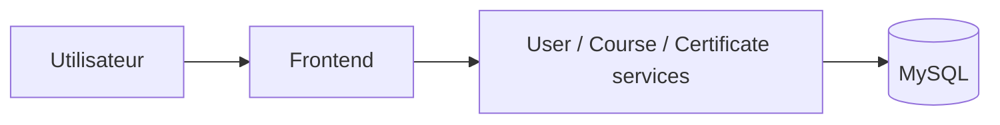

# TrainingHub

TrainingHub est un PFE DevSecOps de gestion des formations, des inscriptions et
des certificats. Le périmètre contient quatre services Flask, une base MySQL,
une chaîne CI/CD et un déploiement Kubernetes.

| Service | Rôle | Port local |
| --- | --- | --- |
| `frontend-service` | Portail web public, learner et admin | `3000` |
| `user-service` | Comptes, profils, JWT et rôles | `5001` |
| `course-service` | Formations et inscriptions | `5002` |
| `certificate-service` | Émission, PDF et vérification des certificats | `5004` |
| MySQL | Stockage des données | `3306` |



## Lancement avec Docker Compose

Prérequis : Docker Desktop avec Docker Compose.

Depuis PowerShell, à la racine du dépôt :

```powershell
Copy-Item .env.example .env
notepad .env
```

Remplacer au minimum les valeurs de `SECRET_KEY`, `JWT_SECRET_KEY`,
`MYSQL_ROOT_PASSWORD`, `MYSQL_PASSWORD` et `DEFAULT_ADMIN_PASSWORD`. Le fichier
`.env` est ignoré par Git et ne doit jamais être versionné.

```powershell
docker compose up --build -d
docker compose ps
```

Interfaces disponibles :

- application : <http://localhost:3000>

Le compte administrateur utilise `DEFAULT_ADMIN_EMAIL` et
`DEFAULT_ADMIN_PASSWORD` définis dans `.env`.

Pour arrêter :

```powershell
docker compose down
```

Pour supprimer aussi les données locales MySQL :

```powershell
docker compose down -v
```

## Shift Left et CI/CD

Les contrôles sont exécutés tôt dans GitHub Actions, à chaque push sur `main` ou
`develop` et à chaque pull request vers `main`. Aucun hook Git local ne bloque
les commits ou les push.

La CI exécute :

1. Gitleaks pour les secrets ;
2. Flake8, Pytest avec au moins 55 % de couverture et Bandit ;
3. pip-audit pour les dépendances ;
4. Kubeconform et Trivy pour Kubernetes ;
5. le build des quatre images et Docker Scout pour les vulnérabilités ;
6. la publication des images validées dans GHCR sur `main`.

Le workflow CD est déclenché avec un tag d’image immuable. Il récupère les
secrets de l’environnement GitHub `production`, déploie sur Kubernetes, attend
les rollouts, lance les smoke tests et effectue un rollback en cas d’échec.


## Kubernetes local avec Kind

Prérequis : Docker, Kind et `kubectl`.

```powershell
kind create cluster --name traininghub
kubectl cluster-info --context kind-traininghub
```

Construire les images localement, puis les charger dans Kind :

```powershell
docker build -f infra/docker/user-service.Dockerfile -t user-service:pfe-local .
docker build -f infra/docker/course-service.Dockerfile -t course-service:pfe-local .
docker build -f infra/docker/certificate-service.Dockerfile -t certificate-service:pfe-local .
docker build -f infra/docker/frontend-service.Dockerfile -t frontend-service:pfe-local .
kind load docker-image user-service:pfe-local --name traininghub
kind load docker-image course-service:pfe-local --name traininghub
kind load docker-image certificate-service:pfe-local --name traininghub
kind load docker-image frontend-service:pfe-local --name traininghub
```

Créer les secrets locaux, remplacer toutes les valeurs `CHANGE_ME`, puis
déployer l’application avec les manifests simples :

```powershell
Copy-Item k8s/secret.example.yaml k8s/secret.yaml
notepad k8s/secret.yaml
kubectl apply -f k8s/namespace.yaml
kubectl apply -f k8s/secret.yaml
kubectl apply -f k8s/app-config.yaml
kubectl create configmap mysql-initdb --namespace traininghub --from-file=init.sql=k8s/init.sql --dry-run=client -o yaml | kubectl apply -f -
kubectl apply -f k8s/mysql.yaml
kubectl apply -f k8s/user-service.yaml
kubectl apply -f k8s/course-service.yaml
kubectl apply -f k8s/certificate-service.yaml
kubectl apply -f k8s/frontend.yaml
kubectl wait --for=condition=Available deployment --all -n traininghub --timeout=300s
kubectl get pods -n traininghub
kubectl get services,pvc -n traininghub
```

Accès au portail :

```powershell
kubectl port-forward -n traininghub service/frontend-service 3000:3000
```


## Structure utile

- `services/` : les quatre services Flask ;
- `infra/` : Dockerfiles et initialisation MySQL ;
- `k8s/` : manifests Kubernetes simples pour l’application ;
- `.github/workflows/` : pipelines CI et CD ;
- `tests/` : tests automatisés des API ;
- `postman/` : collection de démonstration des API.
