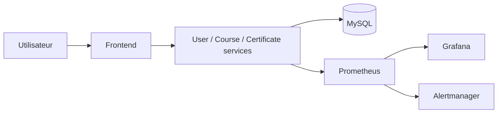

# TrainingHub

TrainingHub est un PFE DevSecOps de gestion des formations, des inscriptions et
des certificats. Le périmètre contient quatre services Flask, une base MySQL,
une chaîne CI/CD, un déploiement Kubernetes et une stack d’observabilité.

| Service | Rôle | Port local |
| --- | --- | --- |
| `frontend-service` | Portail web public, learner et admin | `3000` |
| `user-service` | Comptes, profils, JWT et rôles | `5001` |
| `course-service` | Formations et inscriptions | `5002` |
| `certificate-service` | Émission, PDF et vérification des certificats | `5004` |
| MySQL | Stockage des données | `3306` |



## Lancement avec Docker Compose

Prérequis : Docker Desktop avec Docker Compose.

Depuis PowerShell, à la racine du dépôt :

```powershell
Copy-Item .env.example .env
notepad .env
```

Remplacer au minimum les valeurs de `SECRET_KEY`, `JWT_SECRET_KEY`,
`MYSQL_ROOT_PASSWORD`, `MYSQL_PASSWORD` et `DEFAULT_ADMIN_PASSWORD`. Le fichier
`.env` est ignoré par Git et ne doit jamais être versionné.

```powershell
docker compose up --build -d
docker compose ps
```

Interfaces disponibles :

- application : <http://localhost:3000>
- Prometheus : <http://localhost:9090>
- Grafana : <http://localhost:3001>
- Alertmanager : <http://localhost:9093>

Le compte administrateur utilise `DEFAULT_ADMIN_EMAIL` et
`DEFAULT_ADMIN_PASSWORD` définis dans `.env`.

Pour arrêter :

```powershell
docker compose down
```

Pour supprimer aussi toutes les données locales MySQL et de monitoring :

```powershell
docker compose down -v
```

## Shift Left et CI/CD

Les contrôles sont exécutés tôt dans GitHub Actions, à chaque push sur `main` ou
`develop` et à chaque pull request vers `main`. Aucun hook Git local ne bloque
les commits ou les push.

La CI exécute :

1. Gitleaks pour les secrets ;
2. Flake8, Pytest avec au moins 55 % de couverture et Bandit ;
3. pip-audit pour les dépendances ;
4. Kustomize, Kubeconform et Trivy pour Kubernetes ;
5. le build des quatre images et Docker Scout pour les vulnérabilités ;
6. la publication des images validées dans GHCR sur `main`.

Le workflow CD est déclenché avec un tag d’image immuable. Il récupère les
secrets de l’environnement GitHub `production`, déploie sur Kubernetes, attend
les rollouts, lance les smoke tests et effectue un rollback en cas d’échec.

## Threat model STRIDE

Les actifs principaux sont les comptes, JWT, mots de passe, données de
formation, inscriptions, certificats et secrets d’infrastructure.

| Menace | Risque principal | Contrôles |
| --- | --- | --- |
| Spoofing | Usurpation d’un utilisateur | JWT signé, expiration, issuer, audience et RBAC |
| Tampering | Modification de données ou d’images | Validation des entrées, images scannées, filesystem en lecture seule |
| Repudiation | Action impossible à retracer | Logs JSON et corrélation par `X-Request-ID` |
| Information disclosure | Exposition de secrets ou certificats | GitHub/Kubernetes Secrets, Gitleaks et contrôle d’accès |
| Denial of service | Saturation des API | Limites de ressources, HPA, health checks et rate limiting Ingress |
| Elevation of privilege | Accès admin non autorisé | RBAC applicatif, conteneurs non-root, seccomp et capabilities supprimées |

Les frontières de confiance principales sont le navigateur, l’Ingress, les
services applicatifs, MySQL, GHCR et le cluster Kubernetes. Les NetworkPolicy
limitent les communications entre ces zones.

## Kubernetes local avec Minikube

Prérequis : Minikube et `kubectl`.

```powershell
minikube start --cpus=2 --memory=3072
minikube addons enable metrics-server
minikube addons enable ingress
```

Construire les images directement dans Minikube :

```powershell
minikube image build -f infra/docker/user-service.Dockerfile -t user-service:pfe-local .
minikube image build -f infra/docker/course-service.Dockerfile -t course-service:pfe-local .
minikube image build -f infra/docker/certificate-service.Dockerfile -t certificate-service:pfe-local .
minikube image build -f infra/docker/frontend-service.Dockerfile -t frontend-service:pfe-local .
```

Créer les secrets locaux, remplacer toutes les valeurs `CHANGE_ME`, puis
déployer l’application et le monitoring :

```powershell
Copy-Item k8s/secret.example.yaml k8s/secret.yaml
notepad k8s/secret.yaml
kubectl apply -f k8s/secret.yaml
kubectl apply -k k8s
kubectl apply -k k8s/monitoring
kubectl get pods -n traininghub
kubectl get pods -n monitoring
```

Accès simple au portail sans configurer l’Ingress :

```powershell
kubectl port-forward -n traininghub service/frontend-service 3000:3000
```

## Observabilité

Chaque service expose `/health` et `/metrics`. Prometheus collecte les métriques
de disponibilité, débit, erreurs et latence. Grafana fournit le dashboard
`TrainingHub - Observability`; Alertmanager reçoit les alertes de service
indisponible, taux d’erreurs élevé et latence excessive.

Dans Kubernetes, ouvrir les interfaces avec :

```powershell
kubectl port-forward -n monitoring service/grafana 3001:3000
kubectl port-forward -n monitoring service/prometheus 9090:9090
kubectl port-forward -n monitoring service/alertmanager 9093:9093
```

Les logs applicatifs sont structurés en JSON et utilisent `X-Request-ID` pour
suivre une requête entre les composants.

## Structure utile

- `services/` : les quatre services Flask ;
- `infra/` : Dockerfiles, MySQL et configuration de monitoring ;
- `k8s/` : manifests, Kustomize, HPA, Ingress et NetworkPolicy ;
- `.github/workflows/` : pipelines CI et CD ;
- `tests/` : tests automatisés des API ;
- `postman/` : collection de démonstration des API.
