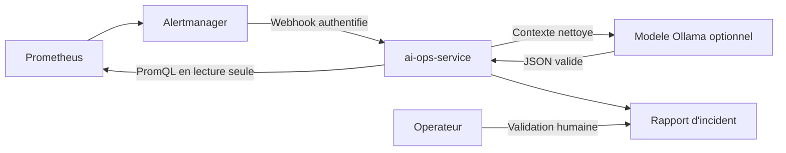

# Assistant AIOps de TrainingHub

## Objectif

L'assistant AIOps reduit le temps de qualification d'une alerte sans prendre de
decision a la place de l'operateur. Il recoit les alertes d'Alertmanager,
recupere un contexte metrique limite dans Prometheus et produit un diagnostic
structure avec des recommandations.

## Flux



## Contrat de securite

- aucune permission Kubernetes, Docker ou base de donnees ;
- webhook protege par un jeton Bearer, avec `X-AIOPS-Token` pour les tests manuels ;
- services et requetes PromQL places sur liste blanche ;
- alertes considerees comme des entrees non fiables ;
- secrets et jetons masques avant l'appel au modele ;
- taille des requetes, des textes et de l'historique limitee ;
- sortie du modele validee avant utilisation ;
- repli sur des regles deterministes si le modele est indisponible ;
- recommandations informatives, sans remediation automatique.

## Modes d'analyse

| Mode | Usage |
| --- | --- |
| `rules` | Developpement, tests et solution de secours reproductible |
| `ollama` | Demonstration et evaluation reelles avec un modele local |
| `rules_fallback` | Mode automatique lorsque le modele repond mal ou expire |

Le service utilise l'API locale Ollama. Aucun modele n'est telecharge ou lance
automatiquement par TrainingHub. Le choix du modele et les ressources necessaires
restent explicites dans l'environnement de demonstration.

Le profil local s'active explicitement :

```powershell
docker compose --profile ai up -d ollama
docker compose exec ollama ollama pull gemma3:1b
$env:AIOPS_MODEL_PROVIDER = "ollama"
$env:OLLAMA_BASE_URL = "http://ollama:11434"
$env:OLLAMA_MODEL = "gemma3:1b"
$env:AIOPS_MODEL_TIMEOUT_SECONDS = "180"
docker compose up -d --build --force-recreate ai-ops-service
```

Le modele `gemma3:1b` limite le volume telecharge et fournit un premier objet de
comparaison. Son exactitude ne doit pas etre supposee : elle est mesuree par les
scenarios d'incident et comparee au mode de regles.

Le jeton present dans la configuration Docker locale est uniquement une valeur de
demonstration. Le deploiement Kubernetes utilisera un `Secret` et un fichier monte
dans Alertmanager afin d'eviter d'inscrire une valeur de production dans Git.

## Evaluation prevue

Les scenarios `service down`, taux d'erreurs 5xx et latence p95 elevee seront
declenches de facon controlee. Pour chaque scenario, les mesures suivantes seront
conservees : temps de generation, nombre de jetons, cause attendue, cause proposee,
pertinence des recommandations et validation humaine.

La comparaison principale opposera le temps de qualification manuelle au temps de
qualification assistee. Le rapport distinguera clairement les sorties du modele,
les regles de secours et les decisions finales de l'operateur.

La premiere evaluation d'integration et son interpretation sont documentees dans
`docs/aiops-evaluation.md`. Elle a conduit a ajouter un garde-fou qui interdit au
modele de diminuer la severite emise par Alertmanager tout en conservant sa
classification brute dans les preuves.
