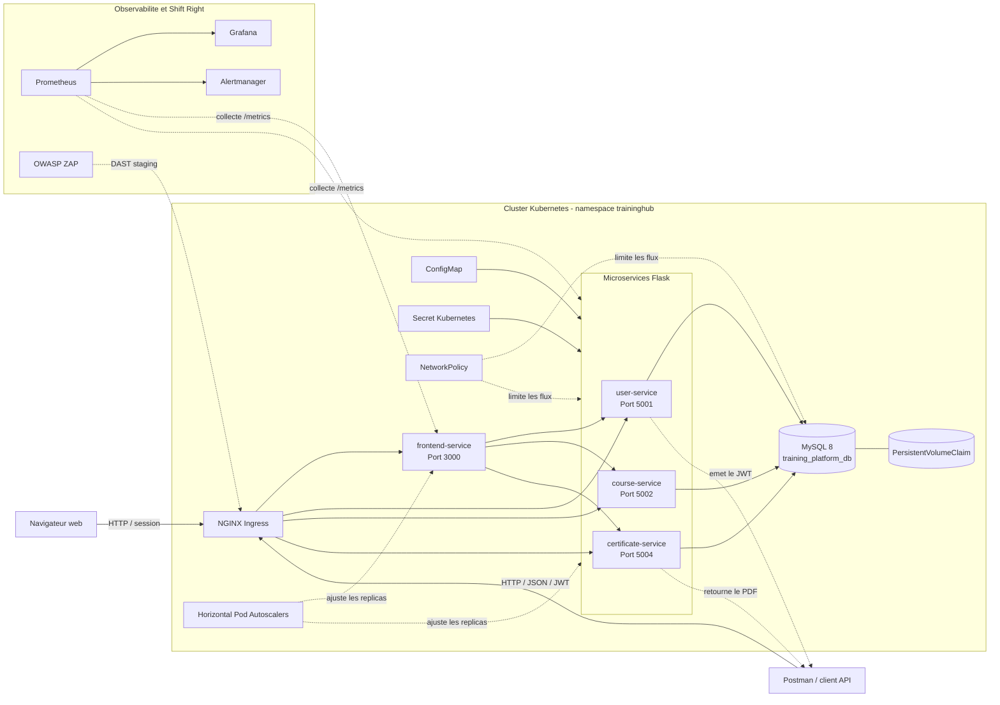

# Architecture technique

## Responsabilites

| Composant | Responsabilite |
| --- | --- |
| `user-service` | Comptes, authentification JWT, profils et roles |
| `course-service` | Catalogue, inscriptions et statut de completion |
| `certificate-service` | Emission, consultation, verification et PDF |
| `frontend-service` | Portail web public, learner et admin |
| MySQL | Persistance partagee du MVP |
| Ingress | Point d'entree et routage HTTP |
| HPA | Adaptation du nombre de replicas selon la charge |
| NetworkPolicy | Segmentation des flux internes |
| Prometheus | Collecte et evaluation des metriques |
| Grafana | Visualisation de la disponibilite, des erreurs et de la latence |
| Alertmanager | Regroupement et suivi des alertes |
| OWASP ZAP | Test dynamique passif de l'environnement deploye |
