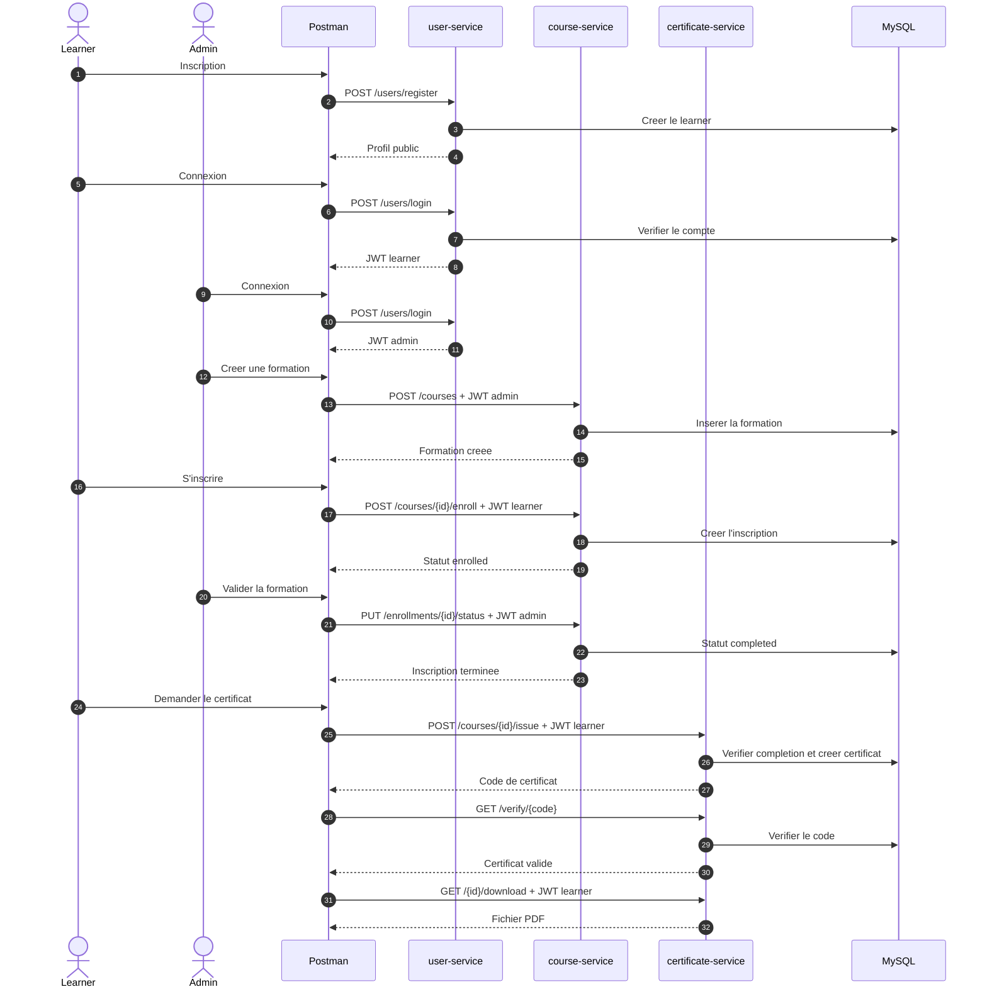

# Parcours metier de bout en bout

```mermaid
sequenceDiagram
    autonumber
    actor Learner
    actor Admin
    participant Client as Postman
    participant Users as user-service
    participant Courses as course-service
    participant Certs as certificate-service
    participant DB as MySQL

    Learner->>Client: Inscription
    Client->>Users: POST /users/register
    Users->>DB: Creer le learner
    Users-->>Client: Profil public

    Learner->>Client: Connexion
    Client->>Users: POST /users/login
    Users->>DB: Verifier le compte
    Users-->>Client: JWT learner

    Admin->>Client: Connexion
    Client->>Users: POST /users/login
    Users-->>Client: JWT admin

    Admin->>Client: Creer une formation
    Client->>Courses: POST /courses + JWT admin
    Courses->>DB: Inserer la formation
    Courses-->>Client: Formation creee

    Learner->>Client: S'inscrire
    Client->>Courses: POST /courses/{id}/enroll + JWT learner
    Courses->>DB: Creer l'inscription
    Courses-->>Client: Statut enrolled

    Admin->>Client: Valider la formation
    Client->>Courses: PUT /enrollments/{id}/status + JWT admin
    Courses->>DB: Statut completed
    Courses-->>Client: Inscription terminee

    Learner->>Client: Demander le certificat
    Client->>Certs: POST /courses/{id}/issue + JWT learner
    Certs->>DB: Verifier completion et creer certificat
    Certs-->>Client: Code de certificat

    Client->>Certs: GET /verify/{code}
    Certs->>DB: Verifier le code
    Certs-->>Client: Certificat valide

    Client->>Certs: GET /{id}/download + JWT learner
    Certs-->>Client: Fichier PDF
```
