# Pipeline DevSecOps CI/CD

```mermaid
flowchart LR
    Dev[Developpeur] --> Commit[Commit / Push]
    Commit --> Hooks[Pre-commit<br/>YAML, Flake8, Bandit, Gitleaks]
    Hooks --> GitHub[Depot GitHub]

    subgraph CI[Integration continue]
        Secrets[Gitleaks]
        Lint[Flake8]
        Tests[Pytest + couverture >= 55%]
        SAST[Bandit]
        SCA[pip-audit]
        IaC[Trivy IaC]
        Build[Build des 5 images]
        Scan[Docker Scout]

        Secrets --> Lint --> Tests --> SAST --> SCA --> IaC --> Build --> Scan
    end

    GitHub --> CI
    Scan -->|branche main| GHCR[(GitHub Container Registry)]

    subgraph CD[Deploiement continu]
        Approval[Environnement production<br/>approbation optionnelle]
        Render[Kustomize<br/>images immuables]
        Deploy[Rolling update Kubernetes]
        Verify[Rollout status + smoke tests]
        Rollback[Rollback automatique]

        Approval --> Render --> Deploy --> Verify
        Verify -. echec .-> Rollback
    end

    GHCR --> CD
    Verify -->|succes| Running[TrainingHub sur Kubernetes]

    subgraph Observability[Monitoring et observabilite]
        Prometheus[Prometheus<br/>metriques RED]
        Dashboard[Grafana]
        Alerts[Alertmanager]
        AIOps[ai-ops-service<br/>lecture seule]
        LLM[Ollama / Gemma<br/>optionnel]
        Human[Operateur humain]

        Prometheus --> Dashboard
        Prometheus --> Alerts
        Alerts --> AIOps
        AIOps -->|PromQL lecture seule| Prometheus
        AIOps -. contexte nettoye .-> LLM
        AIOps --> Human
    end

    Running --> Prometheus
    Human -. feedback valide .-> Dev
```

Le CD n'utilise jamais le secret Kubernetes de demonstration locale. Les valeurs
de production proviennent de l'environnement GitHub protege `production`.
Prometheus, Grafana et Alertmanager supervisent les services deployes. L'assistant
AIOps enrichit les alertes avec le contexte Prometheus et, en option, Ollama ; il
reste en lecture seule et transmet ses recommandations a l'operateur humain.
