# Pipeline DevSecOps CI/CD

```mermaid
flowchart LR
    Dev[Developpeur] --> Commit[Commit / Push]
    Commit --> Hooks[Pre-commit<br/>YAML, Flake8, Bandit, Gitleaks]
    Hooks --> GitHub[Depot GitHub]

    subgraph CI[Integration continue]
        Secrets[Gitleaks]
        Lint[Flake8]
        Tests[Pytest + couverture >= 55%]
        SAST[Bandit]
        SCA[pip-audit]
        IaC[Trivy IaC]
        Build[Build des 4 images]
        Scan[Docker Scout]

        Secrets --> Lint --> Tests --> SAST --> SCA --> IaC --> Build --> Scan
    end

    GitHub --> CI
    Scan -->|branche main| GHCR[(GitHub Container Registry)]

    subgraph CD[Deploiement continu]
        Approval[Environnement production<br/>approbation optionnelle]
        Render[Kustomize<br/>images immuables]
        Deploy[Rolling update Kubernetes]
        Verify[Rollout status + smoke tests]
        Rollback[Rollback automatique]

        Approval --> Render --> Deploy --> Verify
        Verify -. echec .-> Rollback
    end

    GHCR --> CD
    Verify -->|succes| Running[TrainingHub disponible]

    subgraph ShiftRight[Shift Right]
        Metrics[Prometheus<br/>metriques RED]
        Dashboard[Grafana]
        Alerts[Alertmanager]
        DAST[OWASP ZAP]
        Feedback[Feedback et remediation]

        Metrics --> Dashboard
        Metrics --> Alerts
        DAST --> Feedback
        Alerts --> Feedback
    end

    Running --> Metrics
    Running --> DAST
    Feedback --> Dev
```

Le CD n'utilise jamais le secret Kubernetes de demonstration locale. Les valeurs
de production proviennent de l'environnement GitHub protege `production`.
Le Shift Right ferme la boucle grace aux metriques, aux alertes et au rapport
DAST produit apres deploiement.
