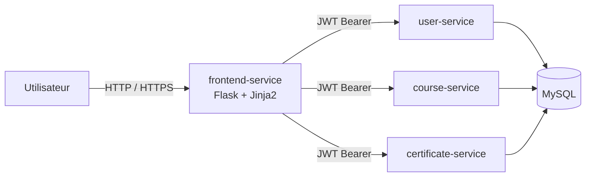

# Architecture du portail web TrainingHub

Le frontend est un service de présentation Flask séparé des trois microservices
métier. Il ne lit jamais directement la base MySQL.

## Gestion de l'authentification

1. le formulaire de connexion est envoyé au frontend avec un jeton CSRF ;
2. le frontend transmet les identifiants au `user-service` ;
3. le JWT retourné est conservé dans une session serveur ;
4. le navigateur reçoit uniquement un cookie de session `HttpOnly` et
   `SameSite=Lax` ;
5. le frontend ajoute le JWT aux appels internes vers les API.

Cette organisation évite de placer le JWT dans `localStorage` et limite
l'exposition directe des microservices au navigateur.

## Sécurité du service

- formulaires protégés contre les attaques CSRF ;
- Content Security Policy et en-têtes HTTP défensifs ;
- validation métier conservée dans les API ;
- conteneur non-root, système de fichiers en lecture seule et capabilities
  Linux supprimées ;
- probes Kubernetes et limites de ressources ;
- analyse Bandit, pip-audit et Docker Scout dans la CI ;
- déploiement et rollback avec les autres services.

## Suppression ou remplacement

Le frontend reste découplé. Pour le retirer, il suffit de supprimer
`services/frontend-service`, son Dockerfile et sa ressource Kubernetes, puis
d'enlever ses blocs dans Docker Compose et les workflows. Les trois API métier
continuent à fonctionner et restent démontrables avec Postman.
