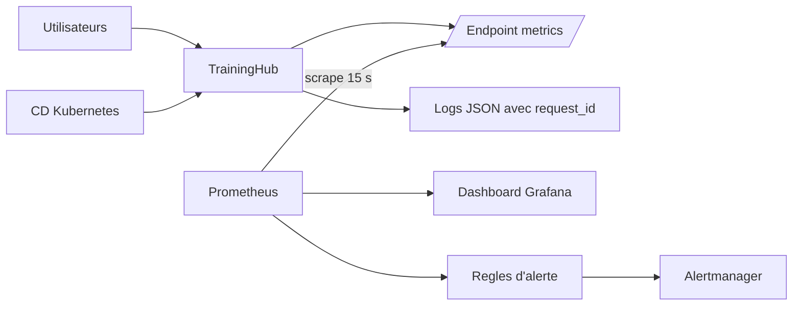

# Monitoring et observabilite de TrainingHub

## Objectif

TrainingHub integre l'observabilite apres le deploiement afin de mesurer le
comportement reel de l'application et de fournir un retour exploitable a
l'operateur humain. Cette capacite complete les controles Shift Left executes
avant publication sans constituer une fonction de securite dynamique.

Le perimetre realise comprend :

- les metriques applicatives et les metriques standard des processus Python ;
- un dashboard Grafana provisionne automatiquement ;
- des alertes de disponibilite, de taux d'erreur et de latence ;
- des logs structures et correles ;
- les health checks, smoke tests et mecanismes de rollback.

## Architecture



## Demarrage local

```powershell
docker compose up --build -d
docker compose ps
```

Interfaces :

| Composant | URL | Utilite |
| --- | --- | --- |
| TrainingHub | `http://localhost:3000` | Application |
| Prometheus | `http://localhost:9090` | Cibles, requetes et alertes |
| Grafana | `http://localhost:3001` | Dashboard `TrainingHub - Observability` |
| Alertmanager | `http://localhost:9093` | Alertes actives et resolues |

Grafana autorise la consultation anonyme en lecture seule. Le compte
d'administration local par defaut est `admin` / `admin`; il doit etre remplace
avec `GRAFANA_ADMIN_USER` et `GRAFANA_ADMIN_PASSWORD` hors demonstration locale.

## Monitoring dans Kubernetes

Une stack legere est egalement deployee dans le namespace `monitoring`.
Prometheus utilise la decouverte Kubernetes pour collecter chaque replica
`Running` annote dans `traininghub`. Grafana et Alertmanager communiquent avec
Prometheus par les Services internes du cluster.

```powershell
kubectl apply -k k8s/monitoring
kubectl get pods -n monitoring
kubectl port-forward -n monitoring service/grafana 3001:3000
```

La documentation complete se trouve dans `../k8s/monitoring/README.md`.

## Metriques exposees

Chaque service fournit `GET /metrics` :

- `traininghub_http_requests_total` : volume par service, methode, route et
  statut ;
- `traininghub_http_request_duration_seconds` : histogramme de latence ;
- `traininghub_http_requests_in_progress` : requetes en cours ;
- metriques standard du processus Python.

Exemples PromQL :

```promql
sum by (service) (rate(traininghub_http_requests_total[5m]))
```

```promql
sum by (service) (rate(traininghub_http_requests_total{status=~"5.."}[5m]))
```

```promql
histogram_quantile(
  0.95,
  sum by (le, service) (
    rate(traininghub_http_request_duration_seconds_bucket[5m])
  )
)
```

## Alertes implementees

- service indisponible pendant plus d'une minute ;
- taux de reponses 5xx superieur a 5 % pendant deux minutes ;
- latence p95 superieure a une seconde pendant cinq minutes.

Pour demontrer une alerte, arreter temporairement un service :

```powershell
docker compose stop course-service
```

Attendre environ une minute, puis ouvrir Prometheus ou Alertmanager. Relancer
ensuite immediatement le service :

```powershell
docker compose start course-service
```

## Logs et correlation

Chaque reponse contient `X-Request-ID`. Chaque service produit un log JSON avec
le meme identifiant, la route normalisee, le statut et la duree. Les mots de
passe, JWT, corps de requete et parametres sensibles ne sont jamais journalises.

Les logs restent consultables avec :

```powershell
docker compose logs -f user-service course-service certificate-service frontend-service
```

Loki ou Elasticsearch peut etre ajoute ulterieurement pour leur centralisation,
mais ce n'est pas necessaire pour demontrer le monitoring et l'observabilite du
MVP.

## Limites et extensions

- Alertmanager affiche les alertes localement. Un receiver e-mail, Slack ou
  Teams necessite un secret externe.
- Les annotations Kubernetes permettent a une instance Prometheus du namespace
  `monitoring` de decouvrir les services.
- Falco, OpenTelemetry, Jaeger et Loki sont des extensions possibles, non
  obligatoires pour le perimetre PFE.

## Perspectives

En perspective, des tests de securite dynamiques (DAST) avec OWASP ZAP pourraient
etre integres sur un environnement de staging afin de completer les controles
Shift Left.
