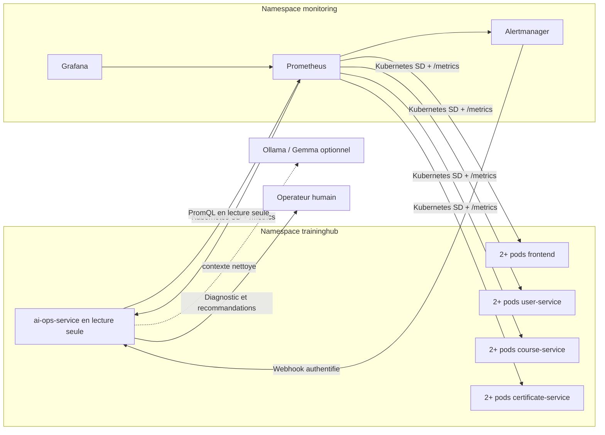

# Monitoring Kubernetes de TrainingHub

Cette stack legere de demonstration execute Prometheus, Grafana et Alertmanager
directement dans Kubernetes, dans le namespace `monitoring`.

## Architecture



Prometheus utilise l'API Kubernetes avec un `ServiceAccount` et un RBAC en
lecture seule. Il decouvre uniquement les pods `Running` du namespace
`traininghub` qui portent l'annotation `prometheus.io/scrape: "true"`.
L'assistance AIOps exploite ces donnees sans permission de remediation ; toute
decision reste sous le controle de l'operateur humain.

## Prerequis

Les images doivent etre presentes dans Minikube :

```powershell
minikube image load prom/prometheus:v3.5.0
minikube image load prom/alertmanager:v0.28.1
minikube image load grafana/grafana:12.1.0
```

## Deploiement

```powershell
kubectl apply -k k8s/monitoring
kubectl rollout status deployment/prometheus -n monitoring
kubectl rollout status deployment/alertmanager -n monitoring
kubectl rollout status deployment/grafana -n monitoring
kubectl get pods -n monitoring
```

## Acces pour la demonstration

Ouvrir trois terminaux et conserver les commandes actives selon les interfaces
souhaitees :

```powershell
kubectl port-forward -n monitoring service/grafana 3001:3000
```

```powershell
kubectl port-forward -n monitoring service/prometheus 9090:9090
```

```powershell
kubectl port-forward -n monitoring service/alertmanager 9093:9093
```

Interfaces :

| Composant | URL | Verification |
| --- | --- | --- |
| Grafana | `http://localhost:3001` | Dashboard `TrainingHub - Observability` |
| Prometheus | `http://localhost:9090/targets` | Tous les replicas `UP` |
| Alertmanager | `http://localhost:9093` | Alertes actives et resolues |

Grafana est accessible en lecture seule sans authentification pour la
demonstration locale.

## Contenu du dashboard

- nombre de services disponibles, independamment du nombre de replicas ;
- debit des requetes metier, sans `/health` et `/metrics` ;
- taux de reponses 5xx, avec une valeur nulle explicite en absence d'erreur ;
- latence p95 par service.

## Alertes

- un service ne possede plus aucun replica joignable pendant une minute ;
- le taux 5xx depasse 5 % pendant deux minutes ;
- la latence p95 depasse une seconde pendant cinq minutes.

## Securite

- namespace `monitoring` separe ;
- RBAC Prometheus limite a la decouverte en lecture seule ;
- conteneurs non-root, seccomp et capabilities supprimees ;
- ressources CPU/memoire bornees ;
- refus entrant par defaut dans `monitoring` ;
- flux internes explicitement autorises ;
- scrapes vers `traininghub` autorises par une NetworkPolicy dediee.

## Limite volontaire du MVP

Les donnees de monitoring utilisent `emptyDir` afin de limiter les ressources
du Minikube de demonstration. En production, utiliser des PVC, des sauvegardes,
des secrets externes et une solution geree ou `kube-prometheus-stack`.

## Suppression

```powershell
kubectl delete -k k8s/monitoring
```
